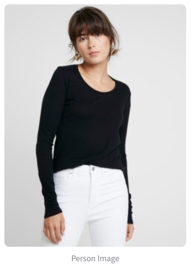
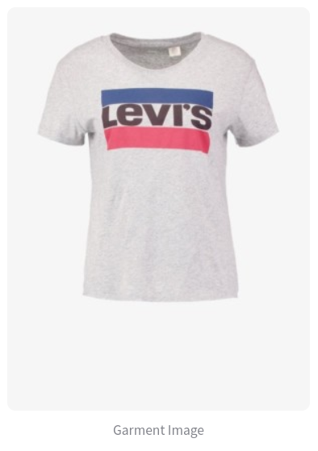
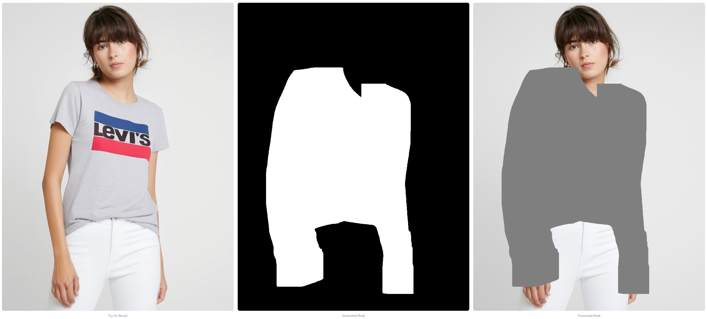
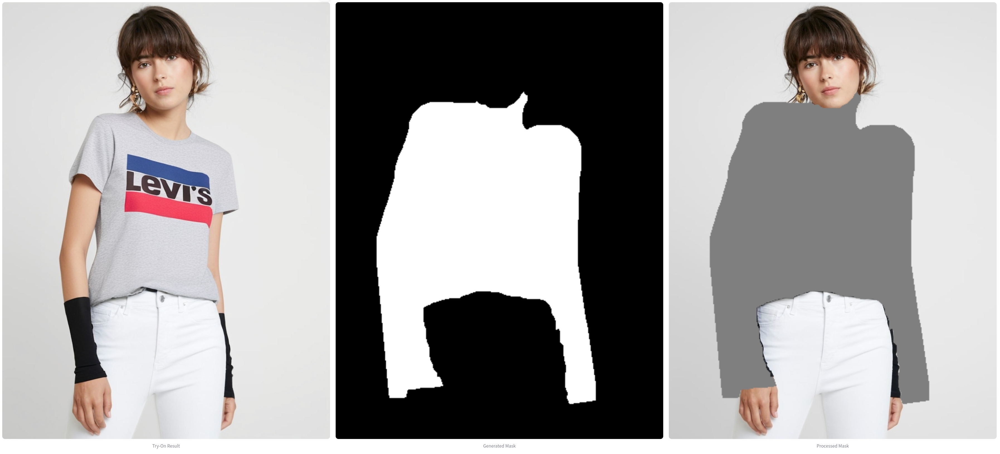

# 👕 Virtual Try-On Pipeline (IDM-VTON + Qwen2.5 + SAM2 + Florence2 + Wan2.1)

This project implements a modular, intelligent **virtual try-on** system using segmentation-guided generative modeling and modern vision-language reasoning. It allows users to upload a garment and a photo of a person, and generates a realistic image of the person wearing the garment. A 360° walk-around video of the try-on result is also under integration.

---

## 🚀 Demo Features

* 📷 Upload person + garment images
* 🧠 Automatic garment description & position (upper/lower) detection via **Qwen2.5 VL**
* 📦 Region detection with **Florence-2**
* ✂️ Fine-grained mask generation with **SAM2**
* 🎨 Virtual try-on using **IDM-VTON**
* 🎮️ (WIP) Generate 360° turntable-style try-on video using **Wan2.1 I2V**
* 🖥️ User-friendly interface via **Streamlit**

---

## 🛠️ Installation & Setup

Follow the steps below to set up and run the Virtual Try-On (VTO) demo locally:

### 1. Clone the Repository

```bash
git clone git@github.com:alarafat/Virtual-Try-On.git
cd Virtual-Try-On
```

### 2. Create and Activate Conda Environment

Create the `vto` environment using the provided `environment.yml` file:

```bash
conda env create -f environment.yml
conda activate vto
```

### 3. Install SAM2 Dependency

Navigate to the SAM2 dependency directory and install it:

```bash
cd dependencies/sam2
pip install -e .
```

### 4. Run the Streamlit Demo

Navigate to the IDM-VTON directory and start the demo:

```bash
cd ../IDM-VTON
streamlit run gradio_demo/demo.py
```

### 5. Access the Demo

Once running, open your browser and go to:

```
http://localhost:8501
```

You should now see the Virtual Try-On interface.

---

> **⚠️ Note:**
> This codebase has been updated for compatibility with `transformers >= 4.51.3`.
> Older versions may cause failures when loading Florence-2 or Qwen2.5.
> Make sure to install:
>
> ```bash
> pip install transformers==4.51.3
> ```

> Also, download required model checkpoints for SAM2, IDM-VTON, and Wan2.1. Place them under their respective directories in `dependencies/`. For issues or troubleshooting, please refer to the documentation or raise an issue in the repository.


---

## 📷 Pipeline Overview

```
Garment Image ─┐
              ├─▶ Qwen2.5 → [Garment position + Description]
Person Image <----------------------|
     ▼
Florence-2 → Bounding Box
     ▼
SAM2       → Segmentation Mask
     ▼
IDM-VTON   → Try-On Image
     ▼
WaN I2V    → (WIP) 360° Rotating Try-On Video
```

---

## 📋 Step-by-Step Process

1. **User uploads** a photo of a person and a clothing image.
2. **Qwen2.5**:
   * Classifies the garment as upper/lower body
   * Generates a descriptive prompt (e.g., "short-sleeve floral blouse")
3. **Florence-2** detects bounding box of the relevant region (e.g., “upper-body cloth”).
4. **SAM2** uses that box to create a high-quality segmentation mask.
5. **IDM-VTON** receives:
   * Person image
   * Cloth image
   * Mask
   * Prompt (garment description came out of Qwen2.5)
     And synthesizes a realistic try-on image.
6. *(WIP)* **WaN I2V** generates a 360° rotating video from the try-on image.
7. *(WIP)* **SDXL** to generate synthetic person images to try the dress on. 
---

## 📊 Results

### 🔍 Input
<table>
  <tr>
    <td align="center"><strong>Person Image</strong></td>
    <td align="center"><strong>Garment Image</strong></td>
  </tr>
  <tr>
    <td></td>
    <td></td>
  </tr>
</table>

---

### 🎯 Virtual Try-On Results

<table>
  <tr>
    <td align="center"><strong>🔬 Our Method (Florence2 + SAM2 + IDM-VTON)</strong></td>
    <td align="center"><strong>📦 IDM-VTON</strong></td>
  </tr>
  <tr>
    <td></td>
    <td></td>
  </tr>
</table>


✅ **Observation**:  
> Our pipeline, integrating **vision-language reasoning and precise segmentation**, produced a **sharper, more accurate, and realistic result** compared to the default IDM-VTON output.  
> The mask quality and garment alignment were visibly superior, especially around sleeve boundaries and contour preservation.


## 🔮 Outlook
This prototype already shows **notable quality improvements** over the baseline IDM-VTON, particularly in segmentation precision and output realism. Going forward, I aim to
combine several advanced AI techniques to deliver a next-generation virtual try-on experience. Future enhancements include:

* 🎮️ **360° Walk-Around View:** Ongoing integration of Wan2.1 I2V to produce dynamic turntable videos
* 🧠 **Full Auto Mode:** Auto cloth detection + prompt generation with Qwen2.5
* 💡 **Multi-Garment Try-On:** Support for layering (tops + bottoms + accessories)
* 📸 **Real-Time Webcam Mode**
* 📦 **API Plugin:** Shopify / WooCommerce integrations
* 📱 **Mobile Inference:** Quantized ONNX + TensorRT versions for lightweight try-on apps

---

## 🧰 Troubleshooting

### ❌ RuntimeError: Input type (float) and bias type (Half)

This may happen when loading Florence2 or using mixed precision in Torch.
✅ Fix: Make sure inputs are cast properly or disable autocast temporarily.

### ❌ AttributeError: 'DaViT' object has no attribute '\_initialize\_weights'

This occurs when using Florence2 with older `transformers` versions.
✅ Fix: Use `transformers >= 4.51.3`.

---

## 📁 Project Structure

```
VTO/
├── demo.py                  # Main Streamlit demo
├── mask_generator.py        # SAM2 + Florence2 integration
├── dependencies/
│   ├── IDM-VITON/           # VTON source and weights
│   └── sam2/                # Segment Anything v2
```

---

## 🧠 Credits

* [IDM-VTON](https://github.com/yisol/IDM-VTON)
* [Qwen2.5](https://huggingface.co/Qwen)
* [Florence-2](https://huggingface.co/microsoft/Florence-2)
* [SAM2](https://github.com/facebookresearch/sam2)
* [Wan2.1 I2V](https://github.com/Wan-Video/Wan2.1)

---

## 📞 Contact

> Created as part of a technical challenge on intelligent fashion try-on.
> If you're interested in extending this to production or want to collaborate, feel free to reach out.
